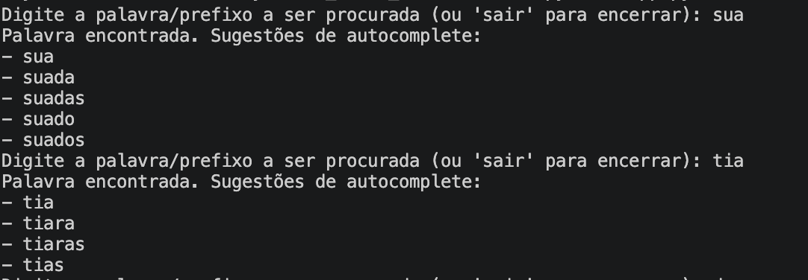

# Sistema de Busca com Autocomplete e Correção Ortográfica usando BST

## Grupo 3
|Matrícula | Aluno |
| -- | -- |
| 22/1022720  | Rayene Ferreira Almeida |
| 20/2017361  | Enzo Fernandes Borges   |

## Sobre 

Este projeto implementa um sistema de busca utilizando Árvore Binária de Busca (BST) para armazenamento eficiente de um dicionário de palavras. O sistema oferece duas funcionalidades principais:

- **Autocomplete**: Sugere palavras que começam com um prefixo fornecido, baseado nas palavras armazenadas na BST.
- **Correção Ortográfica**: Para palavras não encontradas, sugere correções possíveis utilizando o algoritmo de distância de edição (Levenshtein), com limite de distância configurável.

O projeto é desenvolvido em Python e utiliza estruturas de dados para otimizar as operações de busca e sugestão.

## Screenshots




## Pré-requisitos
- Python 3.10 ou superior
- pytest (para execução de testes)

## Instalação

1. Clone o repositório:
   ```
   git clone <url-do-repositorio>
   cd G3_Busca_EDA2-2026.1
   ```

2. Instale as dependências (se necessário):
   ```
   pip install pytest
   ```

## Como Usar

Execute o aplicativo principal:
```
python3 app.py
```

O programa entrará em um loop interativo. Digite uma palavra ou prefixo para obter sugestões. Se a palavra existir no dicionário, serão mostradas sugestões de autocomplete. Caso contrário, serão exibidas sugestões de correção ortográfica. Digite "sair" para encerrar.


## Testes

Para executar os testes:
```
python3 -m pytest
```

Ou para um módulo específico:
```
python3 -m pytest tests/test_bst.py
```

## Video

https://youtu.be/GR3JD_T6aZA

<div align="center">
  <a href="https://youtu.be/GR3JD_T6aZA">
    
  </a>
</div>

<p align="center">
  <b>Autorer:</b>
  <a href="https://github.com/rayenealmeida">Rayene Almeida</a> e 
  <a href="https://github.com/enzo-fb">Enzo Fernandes</a>
</p>


